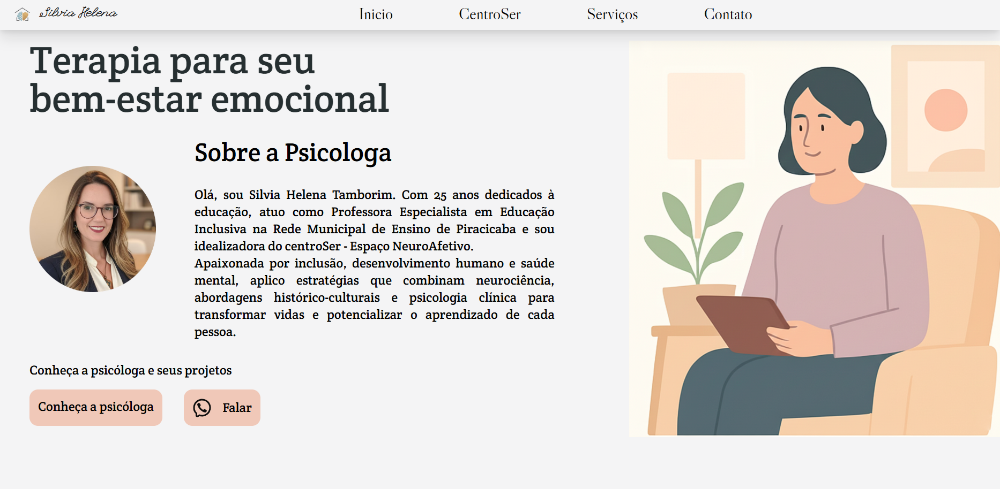

<h1 align="center">Psicóloga</h1>

    

## 💣 Projeto

Projeto de "Psicologa Silvia Helena", site responsivo usando tailwind.

Projeto para uso da psicologa Dra. Silvia Helena.

## 💻 Tecnologias

Esse projeto foi desenvolvido com as seguintes tecnologias:

- [React](https://reactjs.org)
- [JavaScript](https://developer.mozilla.org/pt-BR/docs/Web/JavaScript)
- [Vite](https://vitejs.dev)
- [FramerMotion](https://framer.com/motion/)

## 🚀 Como executar

- Clone o repositório
- Instale as dependências com `npm install`
- Inicie a aplicação com `npm run dev`

A aplicação pode ser acessada em [`localhost:5173`](https://localhost:5173).

Desenvolvido por iSz.